# Bot Detection

How platforms detect a coordinated bot campaign.

## The problem

Detecting a single bot account is straightforward. No profile picture, no followers, posting the same text repeatedly. The hard problem is detecting **sophisticated bot campaigns** where each individual account looks completely legitimate in isolation.

Aged accounts. Real profile pictures. Organic-looking follower counts. Varied post content. The only way to catch them is to stop looking at individual accounts and start looking at **patterns across thousands of accounts simultaneously**; their timing, their graph relationships, and their behavioral signatures relative to what humans actually do.

## How it works

When a user action comes in, four signal analyses run concurrently:

- **Behavioral**: how regular are this account's posting intervals? Humans are irregular. Scripts are not.
- **Timing**: are many accounts acting on the same target within an unnaturally tight window?
- **Graph**: is this account part of an island? Dense internal connections, weak external bridges.
- **Content**: are posts near-duplicates of each other, varied just enough to evade exact matching?

The four scores are combined into a single weighted risk score. Timing and graph carry more weight because they are harder to fake. The final score maps to one of three actions: no action, observe, or suspend.

The observe tier exists deliberately. Suspending one account alerts the operators behind the campaign. Watching longer maps the full network. When the decision is to act, the entire detected cluster is suspended simultaneously.

## Architecture



## File structure

```
bot-detection/
├── go.mod
├── main.go       -- core types, pipeline wiring, example run
├── signals.go    -- concurrent signal collection, four analysis functions
├── scoring.go    -- Signal type, weighted scoring
└── decision.go   -- Decision type, observe/act thresholds
```

## Running

```bash
cd bot-detection
go run .
```

## Key concepts illustrated

- Fan-out concurrency with `sync.WaitGroup` and channels
- Coefficient of variation as a regularity measure
- Inter-event timing distribution for bot synchronization detection
- Internal/external edge ratio for graph island detection
- Jaccard similarity on character bigrams for near-duplicate content detection

## Follow along

New problems drop regularly across these platforms:

- [X](https://x.com/osedagie)
- [LinkedIn](https://www.linkedin.com/in/amos-ehiguese-201b33100)