# Face Recognition

How photo apps recognize your face across 10 years of aging.

## The problem

A photo of you at age 8 and age 40 looks like two completely different
people. Weight changes. Facial hair. Glasses. Aging. A naive facial
recognition system would cluster these as different people.

The harder problem is doing this without you ever labeling a single
photo. No names, no ground truth, no database of known faces. The system
has to figure out that two very different-looking faces belong to the
same person purely from geometry.

## How it works

When a photo is uploaded, every face in it is converted into an
**embedding** -- a list of numbers representing facial geometry. Things
like eye distance, jaw angle, forehead ratio. Two photos of the same
person should produce embeddings that are close together mathematically.
Different people produce embeddings far apart.

The aging problem is solved by **chain connectivity**. Your embedding at
age 8 and age 40 might be too far apart to match directly. But age 8 is
close to age 10, age 10 is close to age 15, and so on all the way to 40.
No single jump is too large. The chain connects them.

When the system is not confident, it does not guess. It creates a new
unnamed cluster and waits. As more photos arrive, evidence builds. When
a chain of connections becomes clear, the clusters merge. This is why
photo apps sometimes ask "are these the same person?" months after you
uploaded the photos -- they were not ready to decide until now.

## Architecture



## File structure

```
face-recognition/
├── go.mod
├── main.go        -- types, pipeline, example with 10 years of aging
├── embedding.go   -- Embedding type, Euclidean distance
└── cluster.go     -- ClusterStore, Assign, CheckAndMerge, centroid drift
```

## Running

```bash
cd face-recognition
go run .
```

## Key concepts illustrated

- Embeddings as geometric representations of faces
- Euclidean distance as a similarity measure
- Unsupervised clustering with no ground truth labels
- Deferred merge decisions to avoid premature wrong assignments
- Centroid drift as a mechanism for tracking faces across time
- Chain connectivity for bridging large embedding gaps

## Read the full write-up

- [Dev.to](https://dev.to/amosehiguese/unsupervised-graph-clustering-how-photo-apps-like-google-photos-track-facial-drift-over-time-2gaf)

## Follow along

- [X](https://x.com/osedagie)
- [LinkedIn](https://www.linkedin.com/in/amos-ehiguese-201b33100)